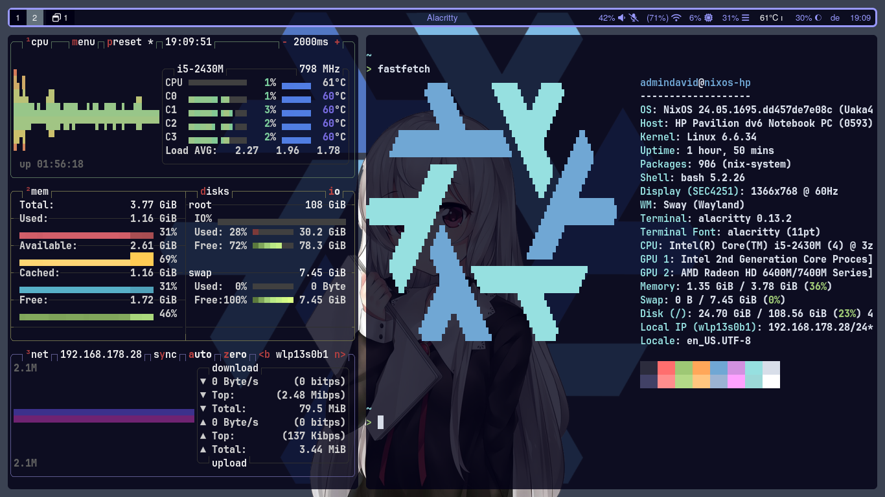
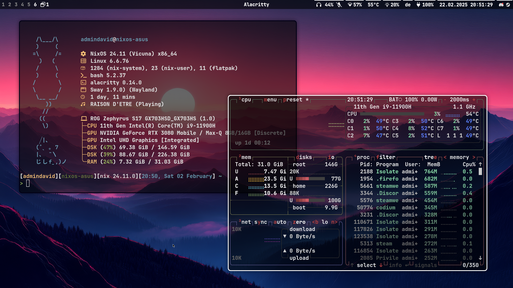

# Welcome to my dotfiles
Seems like you stumbled across my configuration files. Have following along my very little ricing story on NixOS using SwayFx and Waybar.

## History

<details>
  <summary>Version 1: First Try</summary>
  <p>First up with blue primary color, it is my first real try of ricing, which is why i dropped it mid completion in favour for v2.</p>
  
  


</details>

<details>
  <summary>Version 2: Really getting somewhere</summary>
  <p>This is my second try, you may see that the files from the sway, fuzzel directories and waybar/config.jsonc are mostly if not the same compared to v1.
  With more experience i could get more working and i decided to go for a simple style setup, especially for waybar.</p>



  <p>You will see that the NixOS configuration changed quite a lot...</p>

```
v2/etc_nixos
├── channels.nix
├── configuration.nix
├── default.nix
├── general
│   ├── default.nix
│   ├── graphics.nix
│   ├── network.nix
│   └── services.nix
├── hardware-configuration.nix
├── home
│   └── default.nix
├── tui-apps.nix
├── users.nix
└── wallpapers
    └── wallhaven-p9dpgp.jpg
```
  <p>That is because I modularised it, setup the plan for migrating to home-manager, setup nvidia graphics for my main computer and installed for example steam for gaming and regreet as an alternative to tuigreet.</p>
</details>

<details>
  <summary>Version 2.1: Current</summary>
  <p>This is a subversion, as it only involves only small changes</p>


  <p>I tweaked the nix config files with removing and adding new packages. I also cleaned up the waybar and made it more minimalist</p>
  <p>Changing the rgb keyboard leds light level is now seemlessly done with the designated FN key combinations on Asus ROG Laptops</p>
</details>

