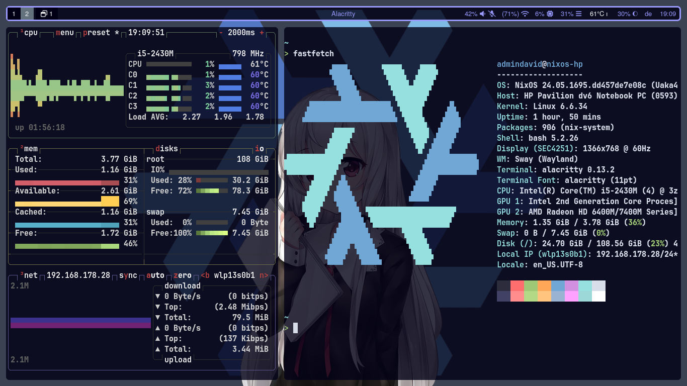
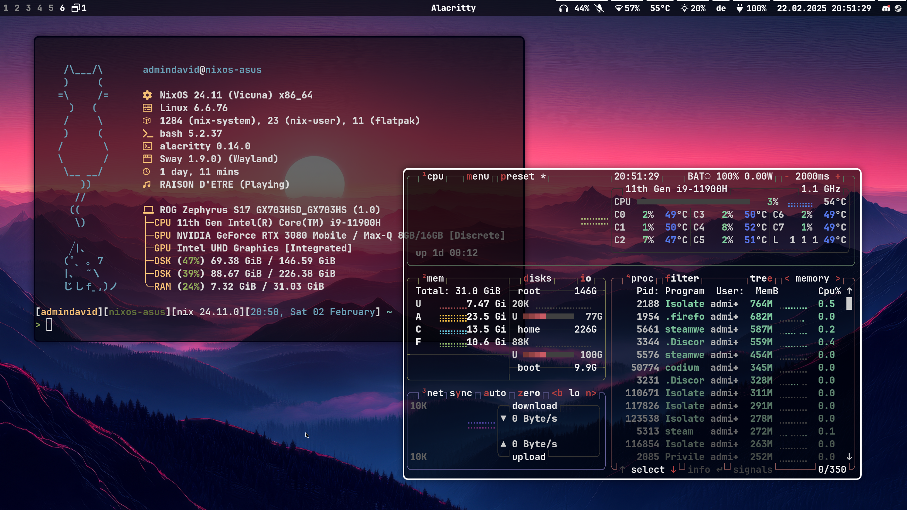

# Welcome to my dotfiles
Seems like you stumbled across my configuration files. Have following along my very little ricing story on NixOS using SwayFx and Waybar.

## Screenshots

  
Version 1

  
First up with blue primary color, it is my first real try of ricing, which is why i dropped it mid completion in favour for v2.

  
  

  
Version 2

  
This is my second try, you may see that the files from the sway, fuzzel directories and waybar/config.jsonc are mostly if not the same compared to v1.
  With more experience i could get more working and i decided to go for a simple style setup, especially for waybar.

  
You will see that the NixOS configuration changed quite a lot...

